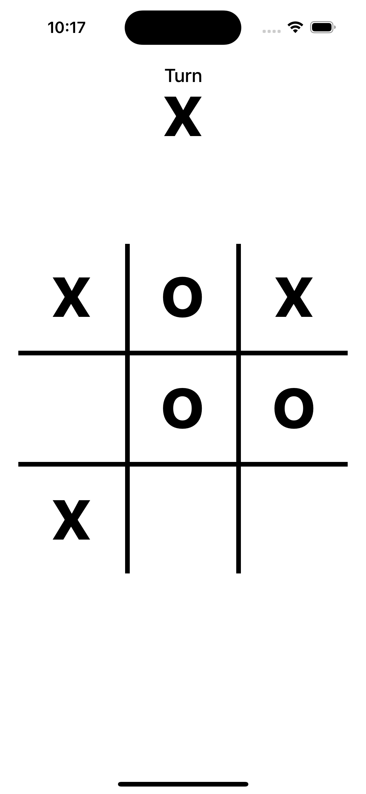
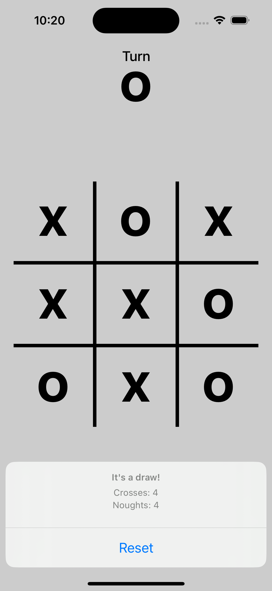
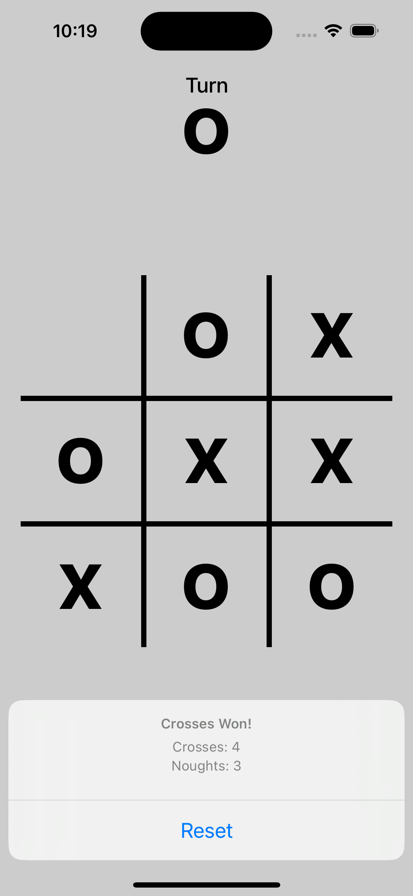

#  Tic-Tac-Toe Game in Swift UIKit

This is a simple Tic-Tac-Toe game that can be played by two players. The game is played on a 3x3 grid. The first player to get 3 of their marks in a row (up, down, across, or diagonally) is the winner. If the board fills up before either player wins, then the game is a draw. 

## Features
- [x] The game can be played by two players.
- [x] The game is played on a 3x3 grid.
- [x] The first player to get 3 of their marks in a row (up, down, across, or diagonally) is the winner.
- [x] If the board fills up before either player wins, then the game is a draw.
- [x] The game can be restarted.
- [x] The game can be played on a simulator or a real device.

## Technologies used
- 
- 
- 
- 
- 

## Screenshots
| Game  | Draw | Win!! |
| :-:| :-: | :-: |
|  |  |  |

## Requirements
- iOS 13.0+
- Xcode 11.0+
- Swift 5.0+

## Installation
1. Clone the repository.
2. Open the terminal and navigate to the project directory.
3. Run the following command to install the dependencies:
``` 
pod install
```
4. Open the project using the .xcworkspace file.
5. Run the project on a simulator or a real device.


## License
This project is licensed under the MIT License - see the [LICENSE](LICENSE) file for details.


